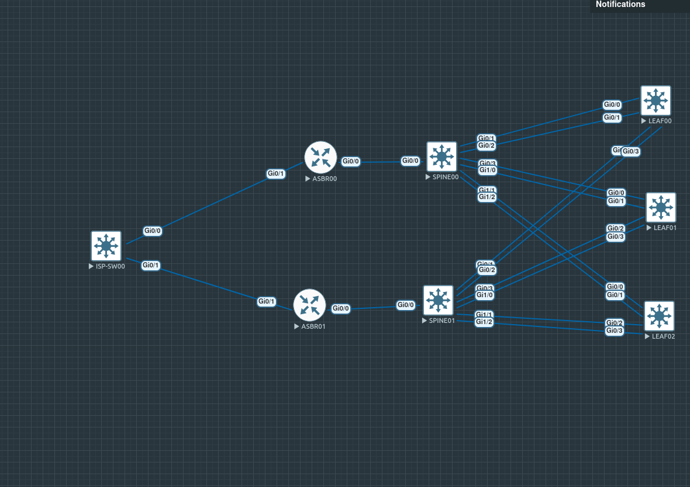

# Cisco Spine-Leaf Campus Lab

**Platform:** EVE-NG | **Simulator:** Cisco IOSv / IOSvL2 | 

A multi-tier enterprise campus topology built in EVE-NG demonstrating OSPF multi-area routing, HSRP first-hop redundancy, ROAS inter-VLAN routing, dual-homed EtherChannel uplinks, and a hardened Layer 2 access edge. The design separates ISP/edge, distribution (spine), and access (leaf) tiers with redundant paths at every layer.

---

## Topology

```
ISP-SW00
  ├── Gi0/0 ──► asbr00 Gi0/1   (uplink to ISP)
  └── Gi0/1 ──► asbr01 Gi0/1   (uplink to ISP)

asbr00 Gi0/0 ──► spine00 Gi0/0   (ROAS trunk)
asbr01 Gi0/0 ──► spine01 Gi0/0   (ROAS trunk)

spine00
  ├── Po1 (Gi0/1, Gi0/2) ──► leaf00 Po1   (dual EtherChannel)
  ├── Po2 (Gi0/3, Gi1/0) ──► leaf01 Po1
  └── Po3 (Gi1/1, Gi1/2) ──► leaf02 Po1

spine01
  ├── Po1 (Gi0/1, Gi0/2) ──► leaf00 Po2   (dual EtherChannel)
  ├── Po2 (Gi0/3, Gi1/0) ──► leaf01 Po2
  └── Po3 (Gi1/1, Gi1/2) ──► leaf02 Po2

leaf00  Gi1/0–Gi1/3  ──► access ports (VLAN 10)
leaf01  Gi1/0–Gi1/3  ──► access ports (VLAN 20)
leaf02  Gi1/0–Gi1/3  ──► access ports (VLAN 30)
```



---

## Device Inventory

| Hostname   | Role              | IOS Version | Loopback0       |
|------------|-------------------|-------------|-----------------|
| ISP-SW00   | ISP edge switch   | 15.2        | —               |
| asbr00     | ASBR / edge router| 15.9        | 10.1.1.1/32     |
| asbr01     | ASBR / edge router| 15.9        | 10.1.1.2/32     |
| spine00    | Distribution / L3 | 15.2        | 10.1.1.5/32     |
| spine01    | Distribution / L3 | 15.2        | 10.1.1.6/32     |
| leaf00     | Access switch     | 15.2        | 10.1.1.22/32    |
| leaf01     | Access switch     | 15.2        | 10.1.1.23/32    |
| leaf02     | Access switch     | 15.2        | 10.1.1.24/32    |

---

## Addressing

### VLAN / SVI subnets

| VLAN | Subnet           | HSRP VIP      | spine00       | spine01       | Purpose    |
|------|------------------|---------------|---------------|---------------|------------|
| 10   | 10.10.10.0/24    | 10.10.10.14   | 10.10.10.15   | 10.10.10.16   | User seg A |
| 20   | 10.20.20.0/24    | 10.20.20.14   | 10.20.20.15   | 10.20.20.16   | User seg B |
| 30   | 10.30.30.0/24    | 10.30.30.14   | 10.30.30.15   | 10.30.30.16   | User seg C |
| 99   | —                | —             | —             | —             | Native/mgmt trunk VLAN |

### ASBR ROAS subinterfaces (Gi0/0)

| VLAN | asbr00           | asbr01           | HSRP VIP      |
|------|------------------|------------------|---------------|
| 10   | 10.10.10.1/24    | 10.10.10.2/24    | 10.10.10.3    |
| 20   | 10.20.20.1/24    | 10.20.20.2/24    | 10.20.20.3    |
| 30   | 10.30.30.1/24    | 10.30.30.2/24    | 10.30.30.3    |

### Spine-to-ASBR inter-router links (ROAS /30s)

Spine uplinks to the ASBRs use dot1Q-tagged /30 subinterfaces in the `172.168.10.0/24` range. Each spine maintains one Port-channel per leaf with per-VLAN subinterfaces (`.10`, `.20`, `.30`).

### Loopback management block

`10.1.1.0/24` — all loopbacks; SSH ACL restricts management plane access to this range.

---

## Routing — OSPF Multi-Area

| Process | Reference BW | Auth      | Areas used |
|---------|-------------|-----------|------------|
| OSPF 1  | 100,000 Mbps | MD5 (area-wide) | Area 0 (backbone), Area 1 (access) |

**Area 0** carries: ASBR loopbacks and ROAS subinterfaces, spine loopbacks and SVIs, inter-device transit links.

**Area 1** carries: spine Port-channel subinterfaces toward leaves, leaf SVI (one per leaf: Vlan10/20/30 respectively).

**Default route propagation:** both ASBRs run `default-information originate` so a default is injected into OSPF from the ISP-facing edge. The ISP uplink (`Gi0/1`) is set `passive-interface` to suppress hellos toward the ISP while still redistributing the connected route.

**MD5 authentication key:** configured per-interface with key ID 1 on all OSPF-participating interfaces across all devices.

---

## First-Hop Redundancy — HSRPv2

HSRP version 2 is deployed on ASBR ROAS subinterfaces and on spine SVIs. Priority is staggered per VLAN to distribute active gateway load:

| VLAN | Active gateway (ASBR tier) | Active gateway (spine SVI tier) |
|------|----------------------------|----------------------------------|
| 10   | asbr00 (priority 255)      | spine00 (priority 255)           |
| 20   | asbr00 (priority 255)      | spine00 (priority 255)           |
| 30   | asbr01 (priority 255)      | spine01 (priority 255)           |

Preempt is enabled on spine SVIs. The HSRP VIPs are the `ip helper-address` targets propagated through DHCP relay.

---

## EtherChannel

All spine-to-leaf uplinks use static `channel-group mode on` (no LACP/PAgP negotiation). Each leaf bundles two physical links per spine into a single Port-channel (Po1 → spine00, Po2 → spine01), giving every leaf a dual-homed active/active uplink to both distribution switches.

Trunk configuration on all Port-channels and uplink interfaces:

- Encapsulation: dot1Q
- Allowed VLANs: 10, 20, 30, 99
- Native VLAN: 99
- DHCP snooping trust + DAI trust on uplink-facing ports

---

## DHCP

DHCP pools are hosted on both spine switches. Each pool covers one VLAN subnet with a 10-hour lease, Cloudflare `1.1.1.1` as DNS, and the HSRP VIP as default-router. Leaf SVIs relay client discover/request packets via `ip helper-address` to the active gateway in each VLAN. Exclusions cover `.0`–`.100` in each /24 to protect infrastructure addresses.

| Pool     | Network          | Default-router |
|----------|------------------|----------------|
| pool10   | 10.10.10.0/24    | 10.10.10.14    |
| pool20   | 10.20.20.0/24    | 10.20.20.14    |
| pool30   | 10.30.30.0/24    | 10.30.30.14    |

---

## Layer 2 Security (access edge)

All leaf access ports (`Gi1/0`–`Gi1/3`) are hardened:

| Feature              | Configuration                                      |
|----------------------|----------------------------------------------------|
| Port Security        | Max 3000 MACs, violation: restrict, auto-recovery  |
| DHCP Snooping        | Enabled VLANs 10/20/30; rate limit 300 pps/port    |
| Dynamic ARP Inspection | Enabled VLANs 10/20/30; validate src-mac + IP; rate limit 300 pps |
| PortFast / BPDU Guard | Edge portfast + bpduguard on all access ports     |
| STP mode             | Rapid-PVST with loopguard default                 |
| errdisable recovery  | Enabled for psecure-violation, dhcp-rate-limit, arp-inspection |

Uplink-facing port-channels have DAI trust and DHCP snooping trust set to prevent false-positive drops on inter-switch traffic.

---

## Management Plane

- **SSH v2 only** — all devices; ciphers locked to AES-CTR variants
- **VTY ACL (`sshmanage`)** — restricts SSH access to the `10.1.1.0/24` loopback management block on all devices except ISP-SW00
- **Console / VTY** — `login local`, `logging synchronous`
- **HTTP/HTTPS** — disabled on ASBRs; enabled on spine and leaf (lab access)
- **CDP/LLDP** — disabled on ASBR ISP-facing interfaces (`Gi0/1`) to limit information exposure upstream
- **Credentials** — `username ethangrishin privilege 15`; secrets stored as type 5 (leaf/spine/ISP) and type 9 (ASBRs)

---

## Files

```
├── README.md
├── topology.png
├── ISP-SW00_config_do_show_running-
├── asbr00_config_do_show_running-co
├── asbr01_config_do_show_running-co
├── spine00show_running-config
├── spine01show_running-config
├── leaf00show_running-config
├── leaf01showrunning-config
└── leaf02show_running-config
```

---


## Lab Platform
